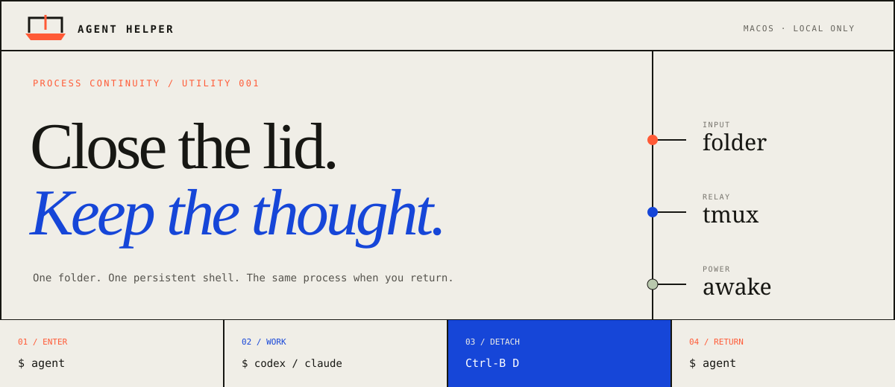
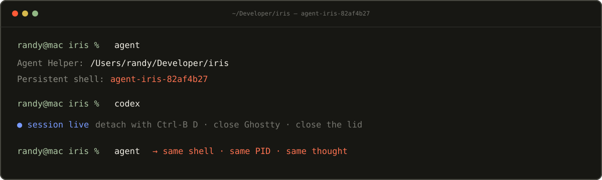

<picture>
  <source media="(prefers-color-scheme: dark)" srcset="assets/hero-dark.svg">
  <source media="(prefers-color-scheme: light)" srcset="assets/hero-light.svg">
  
</picture>

<p align="center">
  
  
  
</p>

Agent Helper gives every project folder one persistent shell. Run `agent`, start Claude or Codex normally, detach or close your terminal, and return to the same process later. tmux preserves the shell; Amphetamine keeps macOS awake when the lid is closed.

No custom dashboard. No agent orchestration. No cloud service. No direct power-management hacks.

<picture>
  
</picture>

## Install

### Requirements

- macOS
- [tmux](https://github.com/tmux/tmux)
- [Amphetamine](https://apps.apple.com/app/amphetamine/id937984704) with Closed-Display Mode and Power Protect enabled
- `~/.local/bin` on your shell's `PATH`

Configure Amphetamine first. The [setup guide](docs/amphetamine-setup.md) covers Power Protect, the 30% battery cutoff, physical closed-lid verification, and rollback.

```sh
git clone https://github.com/randyren278/agent-tooling.git
cd agent-tooling
sh scripts/install.sh
agent doctor
```

The installer creates one symlink at `~/.local/bin/agent`. It does not edit your shell, terminal, Amphetamine settings, or macOS power configuration.

## Four steps

| | Action | What happens |
|---:|---|---|
| **01** | `agent` | Creates or reattaches to this folder's deterministic tmux shell. |
| **02** | `claude` or `codex` | Starts your agent normally, with its standard interface. |
| **03** | `Ctrl-B`, then `D` | Detaches while the process keeps running. You can close the terminal or lid. |
| **04** | `agent` | Returns to the same shell, process, and conversation. |

> [!TIP]
> Press `Ctrl-B`, release both keys, then press `D`. Detaching is different from exiting the shell.

## Commands

```text
agent                 Enter or reattach to this folder's shell
agent status          Show this folder, wake state, and protection readiness
agent list            List every shell managed by Agent Helper
agent stop            Stop this folder; release wake protection if it is last
agent stop --all      Stop every managed shell, then release wake protection
agent wake            Start Amphetamine without entering tmux
agent sleep           End Amphetamine only when no managed shells remain
agent sleep --force   End Amphetamine but leave tmux shells running
agent doctor          Verify dependencies, permissions, and closed-lid proof
agent help            Show concise usage
```

Running `agent` never launches Claude, Codex, or another tool for you. It hands you an ordinary login shell in the original project directory.

## How it works

```text
project folder
      │ canonical path
      ▼
deterministic tmux session ─── preserves shell and child processes
      │ managed-session metadata
      ▼
Amphetamine session ────────── keeps macOS awake while work remains
```

- The canonical folder path maps to a readable tmux name plus a short hash.
- The canonical path is stored in tmux metadata, so names are never reverse-guessed.
- Multiple project shells share one wake state. Stopping one cannot disable protection needed by another.
- Lifecycle commands are serialized to prevent concurrent starts and stops from racing.
- `agent status` distinguishes an active Amphetamine session from verified closed-display readiness.

## Safety

Agent Helper asks Amphetamine to start and stop through its supported AppleScript interface. It never invokes privileged commands, installs a helper, edits system policy, or directly disables macOS sleep.

> [!WARNING]
> Use closed-display mode only on a hard, ventilated surface—never inside a bag. The configured 30% battery cutoff is a backstop, not a guarantee against battery exhaustion, thermal shutdown, crashes, or power loss.

Sessions survive terminal closure and tmux detachment. They do not survive reboot, shutdown, a tmux server crash, or the machine losing power.

## Verify and test

Check the installed system:

```sh
agent doctor
```

Run the complete fake-boundary and real local lifecycle suite:

```sh
sh tests/test_all.sh
```

The suite covers canonical paths, duplicate folder names, symlinks, session ownership, shared wake state, forced sleep, failure injection, concurrency, installation boundaries, real tmux reattachment, and process survival.

## Uninstall

Stop managed work if desired, then remove the installation symlink:

```sh
agent stop --all
sh scripts/install.sh --uninstall
```

Uninstall removes only a symlink owned by this checkout. Amphetamine, Power Protect, their settings, and unrelated tmux sessions remain untouched.

<details>
<summary><strong>Troubleshooting</strong></summary>

### `agent doctor` reports an Automation failure

Allow your terminal application to control Amphetamine in **System Settings → Privacy & Security → Automation**, then rerun `agent doctor`.

### Closed-display protection is not ready

Confirm Closed-Display Mode and Power Protect are enabled in Amphetamine. End any existing Amphetamine session, run `agent wake`, and check `agent status` again.

### `agent` is not found

Confirm `~/.local/bin` is on your `PATH` and that `sh scripts/install.sh --check` passes.

</details>
